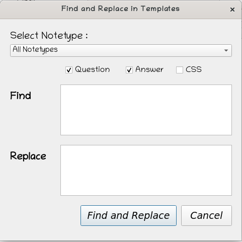

# Find and Replace in Card Templates
===============================================================

** This is an addon for [Anki version 2.1](https://apps.ankiweb.net/). It provides option to find and replace string in card templates individually or in bulk. It might be useful when developing an add-on or creating complex card templates.**

### Requirements
* Supports Anki >= v2.1.20

### Usage
* Adds an item <b>Find and Replace in Templates</b> to the 'Edit' in Browser.
* Select Notetype you want to find and replace the string in templates

### Screenshots

To download and install the addon [visit here](https://ankiweb.net/shared/info/992153575).
****
Works with Anki >= v2.1.20

------

## Author

**Venkata Ramana P**

+ [https://itsmepvr.github.io](https://itsmepvr.github.io)
+ [https://github.com/itsmepvr](https://github.com/itsmepvr)
+ [https://linkedin.com/in/itsmepvr](https://linkedin.com/in/itsmepvr)

------

## Copyright and license

Copyright 2019 Itsmepvr under [The GNU GPL License (GNU)](LICENSE).
